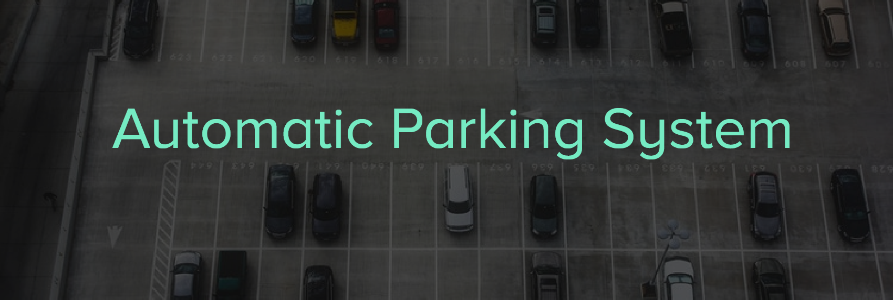
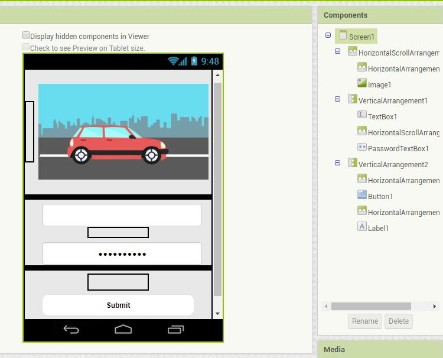
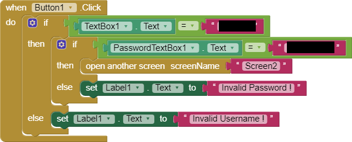
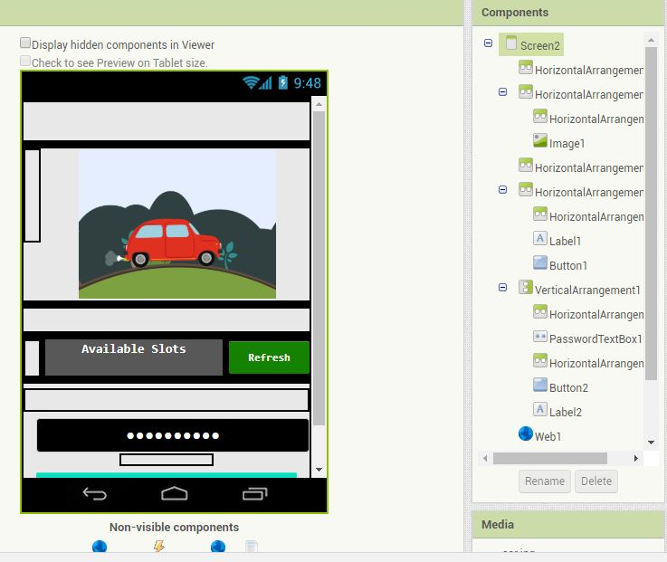
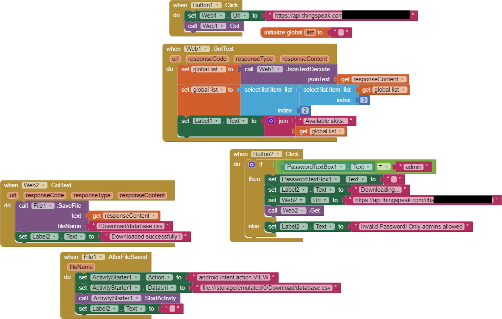
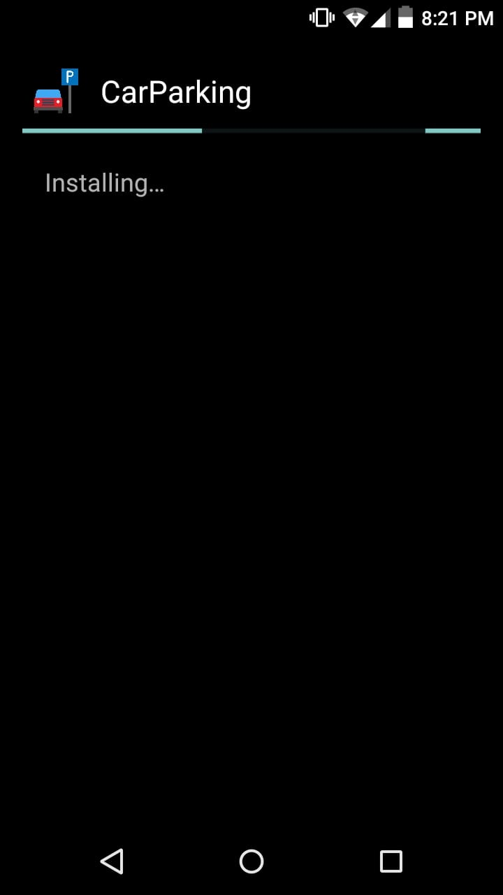
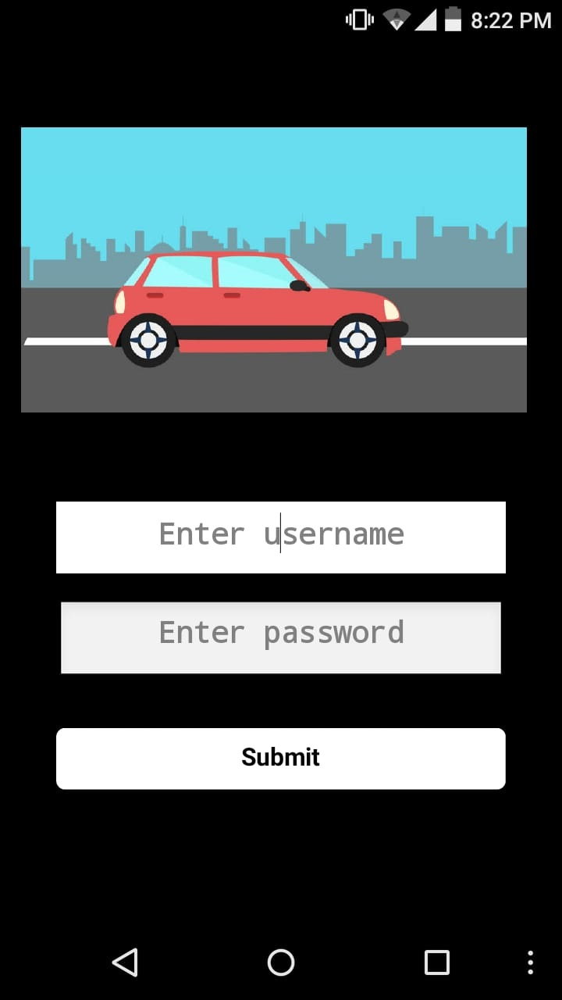
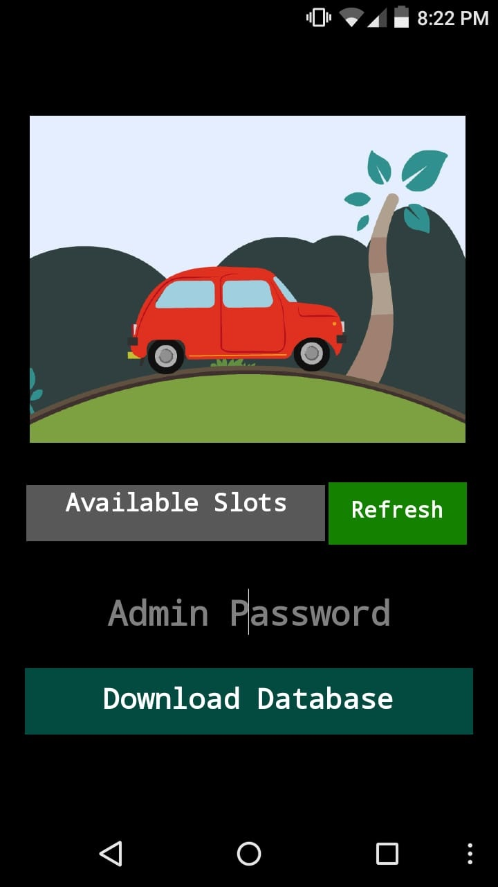
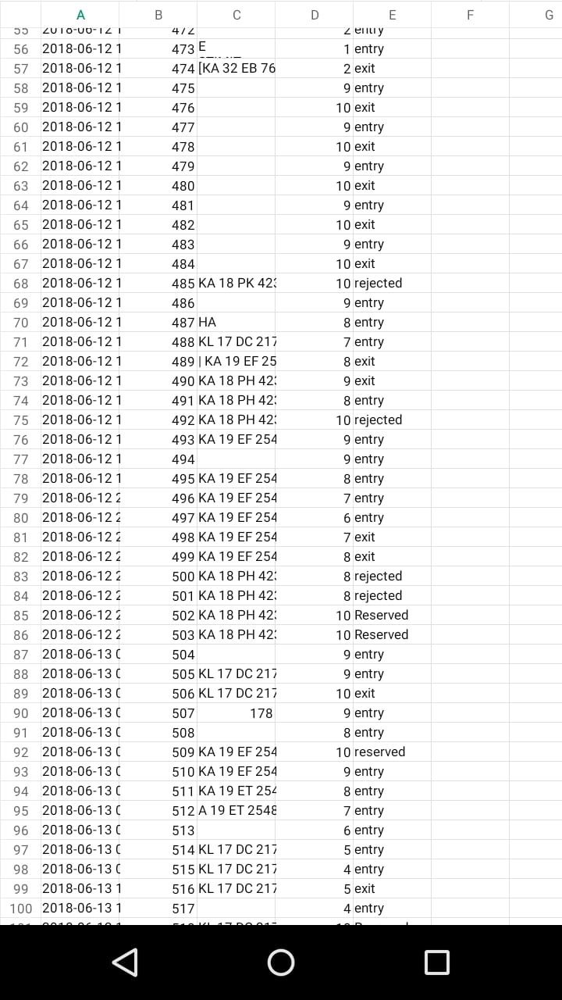

  
<a href="mailto:dev.dibyo@gmail.com">&emsp;&emsp;&emsp;&emsp;&emsp;&emsp;&emsp;&emsp;&emsp;&emsp;&emsp;&emsp;&emsp;&emsp; </a>     

Automatic Parking System is a parking solution designed for the modern establishments that want to manage their parking lot without human assistance. The proposed system consists of fully automated toll gates that control the entry and exit of the vechicles into and from the parking lot. It also features the ability to restrict the entry of blacklisted cars. The live status of the parking slots can be viewed through a mobile application designed for the system admins. The number plates of the cars are recorded on their entry/exit using OCR. The timing of their entry/exit, number plates and the number of empty slots are recorded and stored in database on every operation of the toll gates.
  

#### Dependencies

- Python 3.
- Google Cloud Platform - Vision API.
- OpenCV.
- Raspberry Pi 3.
- PiCamera.
- MG995 servo motors x2.
- IR modules x2.
- Thingspeak.
- Companion App.
  

#### Usage

- Connect the sensors to Raspberry Pi as follows.

&emsp;&emsp;1. <code>IR sensor 1</code> to <code>GPIO 16</code>. 
&emsp;&emsp;2. <code>IR sensor 2</code> to <code>GPIO 18</code>. 
&emsp;&emsp;3. Connect the PCA9865 driver via I2C connection. 
&emsp;&emsp;4. <code>Motor 1</code> to <code>Pin 0</code> of PCA9685. 
&emsp;&emsp;5. <code>Motor 2</code> to <code>Pin 15</code> of PCA9685. 
&emsp;&emsp;5. Connect the PiCamera.
 
 

- Replace the following line in <code>run.py</code> with the Vision API credentials.

&emsp;&emsp;<code>os.environ['GOOGLE_APPLICATION_CREDENTIALS'] = 'GCP_SERVICE_ACCOUNT_CREDENTIALS.json'</code>
  

- Create a Thingspeak Account and create a new project with the following fields. 
<code>number_plate , slots_remaining , status </code>
  
- Create new project in MIT App inventor and create the following blocks.

<table>
	<tr>
		<td>
			
			&emsp;&emsp;&emsp;&emsp;&emsp;Design View of Screen 1
		</td>
		<td>
			
			  &emsp;&emsp;&emsp;&emsp;&emsp;&emsp;&emsp;&emsp;&emsp;&emsp;Block View of Screen 1
		</td>
	</tr>
	<tr>
		<td>
			
			  &emsp;&emsp;&emsp;&emsp;&emsp;Design View of Screen 2
		</td>
		<td>
			
			&emsp;&emsp;&emsp;&emsp;&emsp;&emsp;&emsp;&emsp;&emsp;&emsp;Block View of Screen 2
		</td>
	</tr>
</table>
  
- Run the script on Raspberry Pi as follows  
<code>python3 run.py</code>
  

#### Demonstration

- The follwoing image shows the OCR operation 
  
<a href="assets/ocr.JPG">&emsp;&emsp;&emsp;&emsp;&emsp;&emsp;&emsp;</a>
  
- The following images show the live monitoring from the companion app.
  
<table>
	<tr>
		<td>
			
			<h6>1. Installation.</h6>
		</td>
		<td>
			
			<h6>2. Home Page.</h6>
		</td>
		<td>
			
			<h6>3. After Login.</h6>
		</td>
	</tr>
	<tr>
		<td>
			
			<h6>4. Current parking slots available.</h6>
		</td>
		<td>
			
			<h6>5. Downloading database.</h6>
		</td>
		<td>
			
			<h6>6. Database in .xls format.</h6>
		</td>
	</tr>
</table>
  
© All rights reserved.